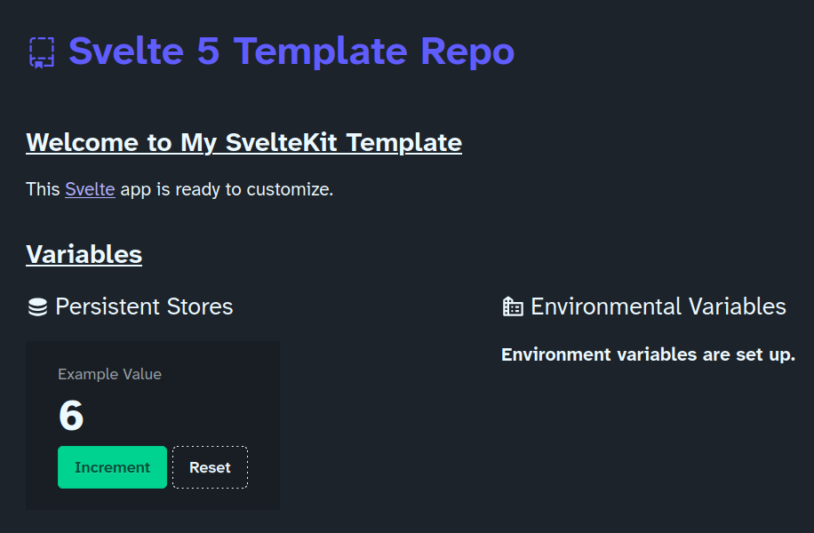

# Template Repo<!-- omit from toc -->

  
 

This template provides a starting point for new web projects. It has been designed to comply with design and performance requirements.

## Table of Contents<!-- omit from toc -->

- [Stack \& Features](#stack--features)
- [Documentation](#documentation)

## Stack & Features

- ⚙️ **Backend:** NodeJS, Vite, Svelte 5
  - 🔧 build requirements are enforced with pre-commit/push hooks (Husky)
  - 📦 enforced and documented version control flow
  - 📁 scripts set up for dependency management
  - 🔒 secure environment variables
  - 🚀 deployment commands (Netlify) are documented
  - 🧹 linting (ESLint) and typing (TypeScript) rules are well-organized
  - 🧪 testing works out-of-the-box (Playwright)
  - 🤖 comprehensive `AGENTS.md` supports LLM assistance
  - 🗂️ standard project structure with well-organized files
  - 🔄 separation of concerns with enforced layer boundaries
  - ⚡ performance optimization with minimized bundle size
  - 🗺️ routing (SvelteKit) complies with SEO metrics
  - 💾 state management (Svelte 5 runes) is easy to set up
  - 🔌 API methods ready for data retrieval and business logic
- 🖥️ **Frontend:** TailwindCSS with DaisyUI, Iconify, Fontsource
  - 🎨 quality icons (Iconify)
  - 📜 quality fonts (Fontsource)
  - 💬 working modal and dialog examples
  - 🔔 notification system
  - 🌓 theming with automatic system detection, user-facing theme switcher
  - 🖨️ print styling
  - 🧩 UI components comply with design standards
  - ♿ accessibility metrics compliance (axe)
  - 📱 perfectly responsive on mobile
  - 📖 feature documentation with plenty of templates

## Documentation

- Project documentation for you to customize:
  - This file! (For ideas, see [matiassingers/awesome-readme](https://github.com/matiassingers/awesome-readme))
  - [Project Requirements](./docs/requirements.md)
- Template documentation:
  - [Version Control](./docs/version-control.md) includes setup instructions
  - [Dependencies](./docs/dependencies.md) instructs on updating dependencies
  - [Deployment](./docs/deployment.md) instructs on deploying to repo and production
  - [Agent Knowledge](AGENTS.md)
  - [Backend Requirements](./docs/requirements-backend.md)
  - [Frontend Requirements](./docs/requirements-frontend.md)
